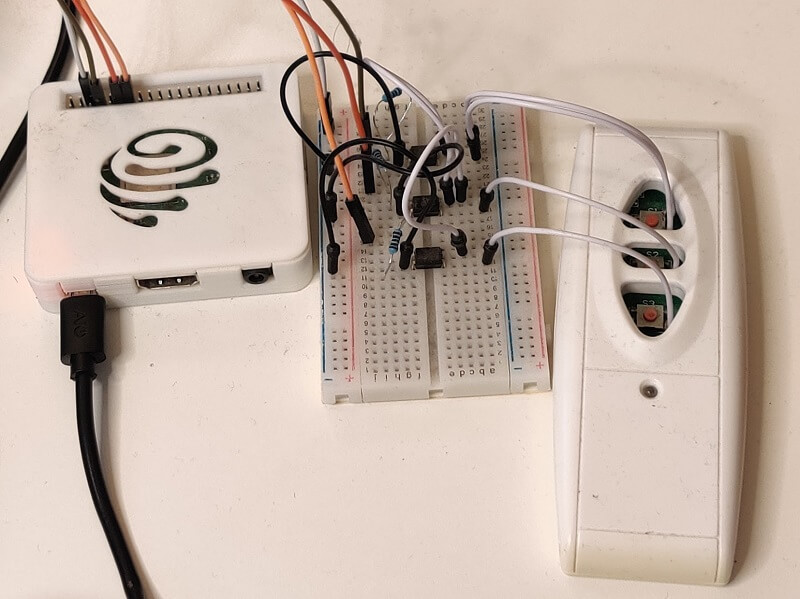

# Smart Projector Screen

This project involves making a dumb projector screen with a RF remote a smart one by triggering button presses on the remote via a Raspberry PI.

## Version 2 (Latest)

This version utilized a cheap 315Mhz transmitter that I managed to order from AliExpress. I used the receiver to capture the RF codes emitted by the remote and used the transmitter to emit them. This iteration resulted far less components in the chain (no octocouplers, resisters, jumper cables, a remote with batteries) but with the same outcome. Besides, now I can repurpose the octocoupler setup for another remote!

TBD Image

## Version 1

This was the initial version of the project. While I could have used RF transmitters, I decided to experiment with octocouplers as the solution seemed like a more generic one to me. 

Here, I connect the GPIO pins of the RPi in to an octocoupler (with apropriate resistance), and use it to complete a circuit on the remote control to simulate a button press. As janky as it looks, this solution worked very reliably.

_don't let your kids near this_

## Setup

- Make sure you have python3
- `pip install -r requirements.txt`

## Usage

- Start the server by running `./server.py`
- The API is now availble on `http://0.0.0.0:8080`

| Path    | Method | Query Parameters | Description                                                                                                                                                             |
| ------- | ------ | ---------------- | ----------------------------------------------------------------------------------------------------------------------------------------------------------------------- |
| `/up`   | `POST` | `None`           | Causes the screen to completely roll up.                                                                                                                                |
| `/down` | `POST` | `timeout=5`      | Causese the screen to roll down, use the `timeout` parameter to issue a stop command after a specific time, useful for controlling how far down the screen should roll. |
| `/stop` | `POST` | `None`           | Sends a stop signal, will halt whatever the operation that was in progress.                                                                                             |
